# EF_VI Zero-Copy Matcher

A C++17/Linux limit-order-book matcher with fixed-capacity memory, deterministic price-time matching, a cache-line-isolated SPSC ring, Linux huge-page support, and an optional DPDK input path.

## Quick start

On Ubuntu or Debian:

    git clone https://github.com/SpryzenHell/ef_vi_matcher.git
    cd ef_vi_matcher
    ./scripts/bootstrap_ubuntu.sh
    ./scripts/run.sh

The normal build does not require DPDK.

The helper script configures CMake, builds the release targets, runs the release tests, and runs the matcher and examples.

## What is included

    include/efvi/
      types.hpp
      spsc_ring.hpp
      fixed_pool.hpp
      order_book.hpp
      transport.hpp
      dpdk_adapter.hpp

    src/
      main.cpp
      hugepage_probe.cpp
      dpdk_adapter.cpp

    tests/
      efvi_tests.cpp
      efvi_property_tests.cpp

    benchmarks/
      efvi_benchmark.cpp
      allocator_benchmark.cpp
      spsc_benchmark.cpp
      efvi_dpdk_benchmark.cpp

    examples/
      order_flow_demo.cpp
      software_rx_loopback.cpp
      dpdk_nic_rx.cpp

    scripts/
      run.sh
      run_experiments.py
      render_readme_assets.py
      benchmark.sh
      hugepages_check.sh
      run_perf.sh

    docs/
      architecture.md
      dpdk.md
      hugepages.md
      performance.md
      reference_run/current/
      images/

## Build manually

Requirements:

| Requirement | Use |
|---|---|
| Linux | memory mapping and optional DPDK |
| C++17 compiler | C++ build |
| CMake 3.20+ | build system |
| POSIX threads | matcher and SPSC code |

Install the basic tools on Ubuntu:

    sudo apt update
    sudo apt install build-essential cmake pkg-config

Build:

    cmake -S . -B build       -DCMAKE_BUILD_TYPE=Release       -DEFVI_ENABLE_DPDK=OFF       -DEFVI_BUILD_TESTS=ON       -DEFVI_BUILD_BENCHMARKS=ON       -DEFVI_BUILD_EXAMPLES=ON

    cmake --build build --parallel
    ctest --test-dir build --output-on-failure

## Run the examples

Matcher:

    ./build/efvi_matcher

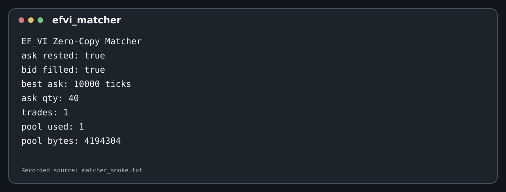

Order flow:

    ./build/efvi_order_flow_demo

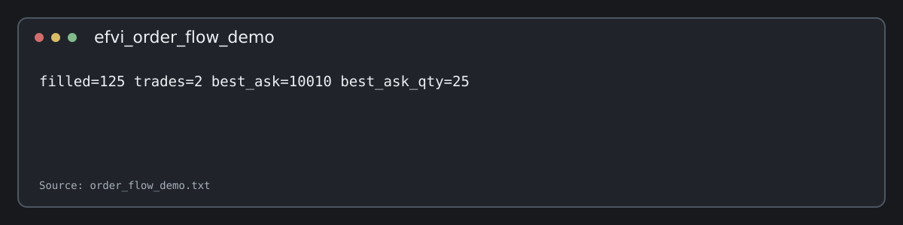

Software RX loopback:

    ./build/efvi_software_rx_demo

The software RX example places the request in a fixed buffer and passes the same request address through the descriptor ring.

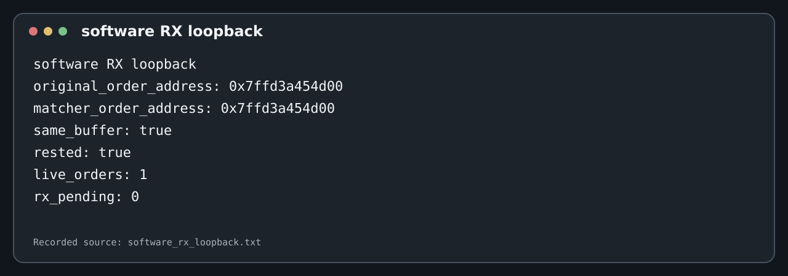

## Tests

The release test suite checks:

| Area | Coverage |
|---|---|
| Matching | price-time FIFO, partial fills, multi-level fills |
| Order types | IOC, FOK, market IOC |
| Book operations | cancel, cancel/replace |
| Replacement | partial-fill bounds and queue-priority rules |
| Order lookup | duplicate IDs, tombstones, reuse |
| Pool | exhaustion, reuse, alignment, size overflow |
| SPSC | full/empty state and ordered transfers |
| Layout | 64-byte request/node/level assumptions |
| Random testing | reference-model comparison across multiple seeds |

Run:

    ctest --test-dir build --output-on-failure

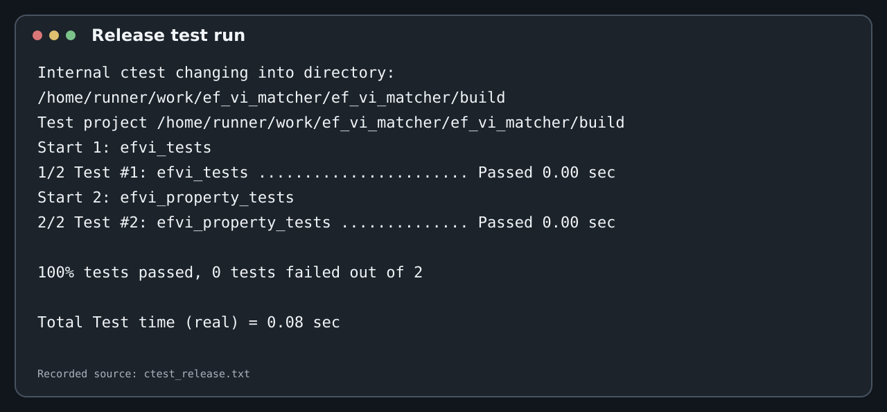

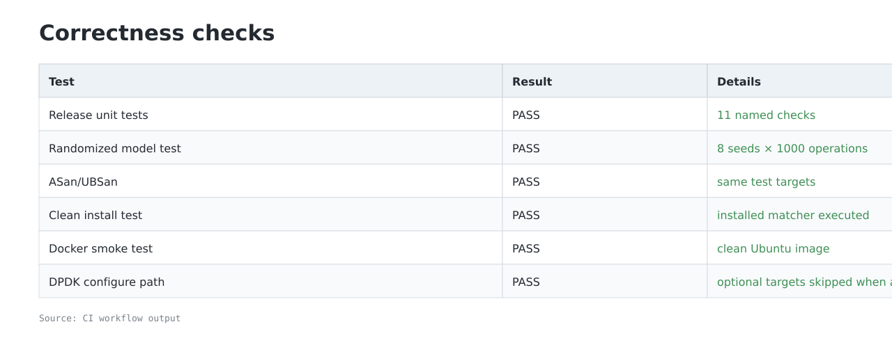

The randomized test compares the matcher against a small reference model after every operation. The recorded run uses 8 seeds and 1,000 operations per seed.

## Sanitizer build

    cmake -S . -B build-asan       -DCMAKE_BUILD_TYPE=Debug       -DEFVI_ENABLE_DPDK=OFF       -DEFVI_ENABLE_SANITIZERS=ON

    cmake --build build-asan --parallel
    ctest --test-dir build-asan --output-on-failure

The CI workflow runs both the release and ASan/UBSan suites.

## Benchmark

Basic benchmark:

    ./build/efvi_benchmark 50000 --normal

The benchmark reports matcher throughput, p50 and p99 operation latency, trade count, live orders, pool mapping size, Linux page size, actual HUGETLB backing, global C++ new calls during the measured matcher loop, and SPSC producer/consumer throughput.

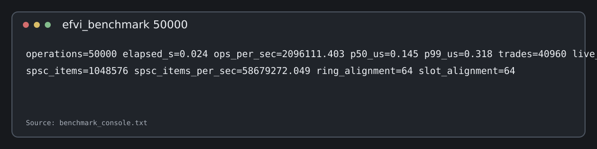

## Repeated experiments

Run the larger benchmark matrix:

    ./scripts/run_experiments.py

The experiment run measures:

| Experiment | Data set |
|---|---|
| Matcher throughput | 10k, 25k, 50k, 100k, 200k operations |
| Matcher latency | p50 and p99 at the same sizes |
| Matcher repeats | 3 runs per size |
| Allocator scaling | 1k, 5k, 10k, 50k, 100k objects |
| Allocator repeats | 3 runs per size |
| SPSC scaling | capacities 1024, 4096, 65536 |
| SPSC repeats | 2 runs per capacity |
| Page mode | normal, auto, 2 MiB, 1 GiB, strict 1 GiB |

Raw CSV and text data are stored in docs/reference_run/current/.

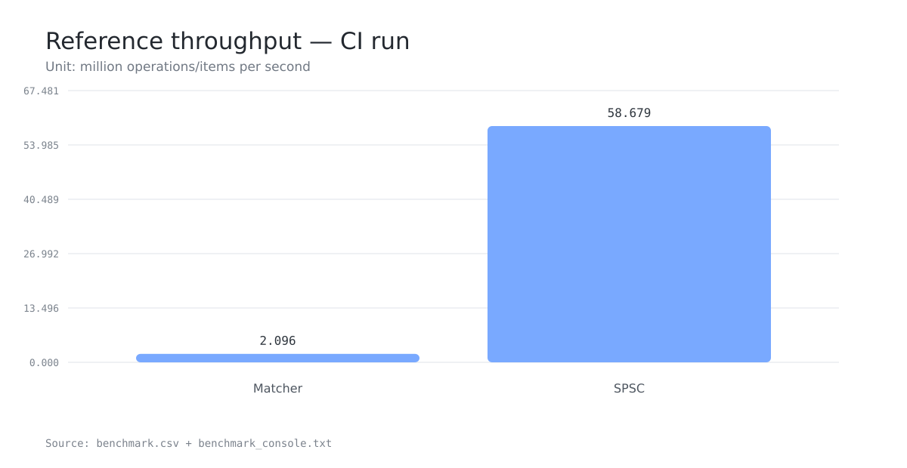

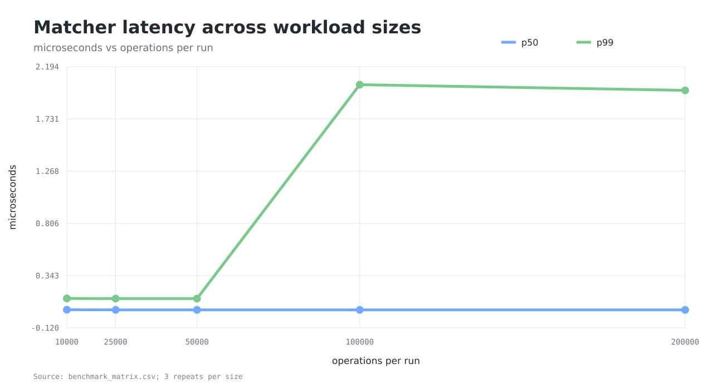

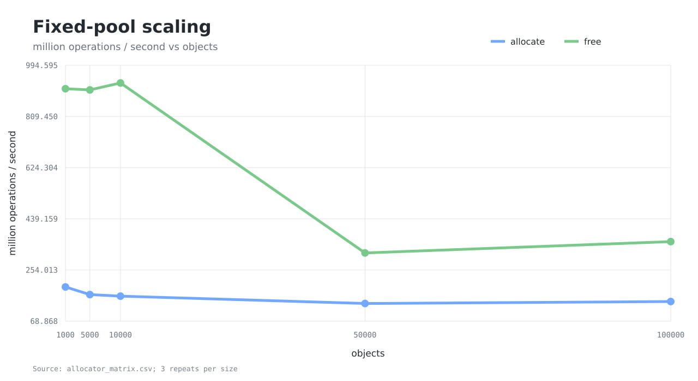

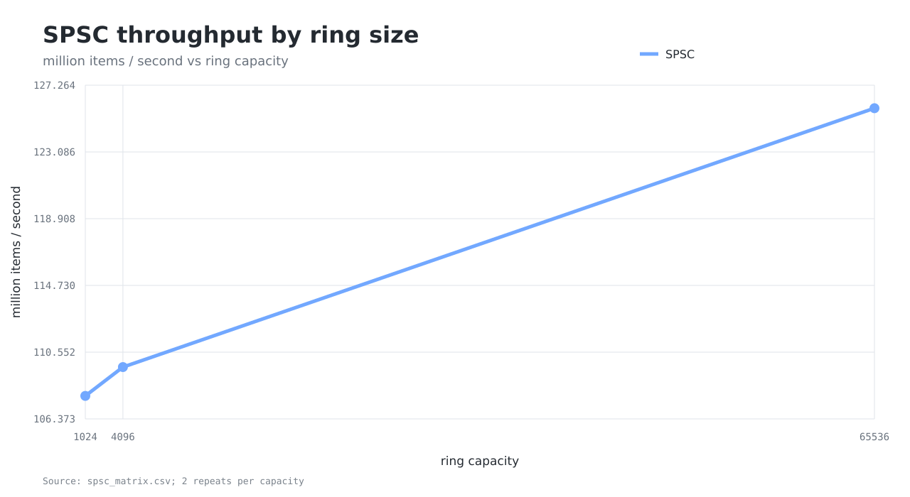

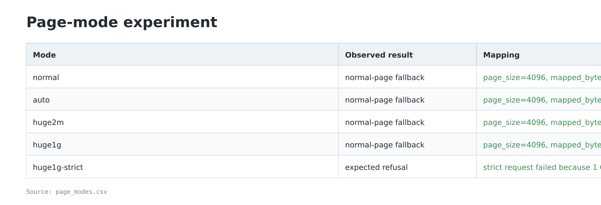

The figures use the recorded CSV data directly. They are measurement summaries, not fixed performance promises.

## Allocator

    ./build/efvi_allocator_benchmark 10000

The pool reserves its arena before the timed operations. The timed path only moves nodes through an intrusive free list.

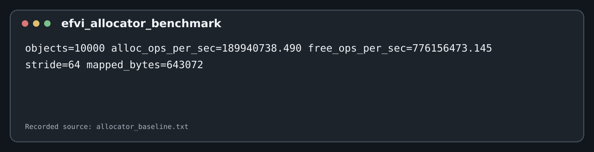

## Huge pages

The pool supports normal pages, 2 MiB HUGETLB pages, 1 GiB HUGETLB pages, and automatic selection.

Check the host:

    ./scripts/hugepages_check.sh

Strict mode:

    ./build/efvi_benchmark 10000 --huge1g --strict

Strict mode refuses normal-page fallback when the requested 1 GiB mapping is not available.

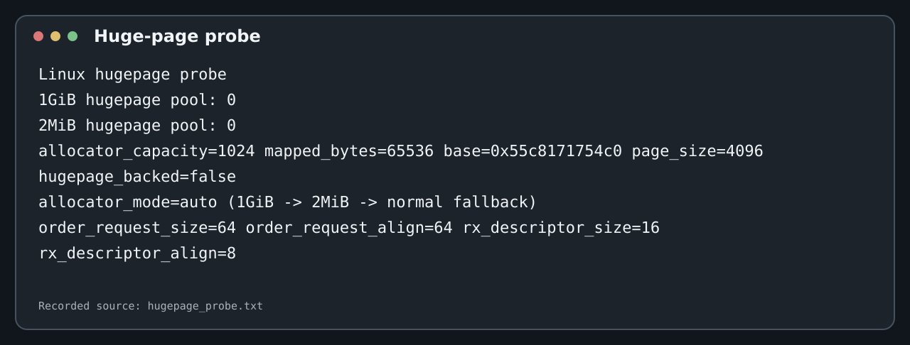

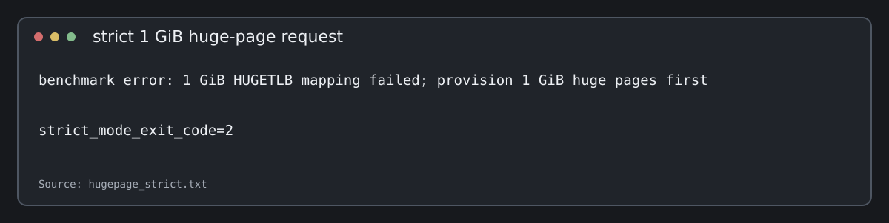

The project does not publish a TLB-miss reduction percentage without a matched target-machine perf experiment.

See docs/hugepages.md and docs/performance.md.

## DPDK

DPDK is optional.

Install the development package:

    sudo apt update
    sudo apt install libdpdk-dev

Configure:

    cmake -S . -B build-dpdk       -DCMAKE_BUILD_TYPE=Release       -DEFVI_ENABLE_DPDK=ON

    cmake --build build-dpdk --parallel

When DPDK is found, the project adds the DPDK library, benchmark and NIC capability probe.

A real NIC run depends on host configuration. The repository does not report a physical-NIC result unless the NIC was actually configured and exercised.

See docs/dpdk.md.

## Docker

    docker build -t efvi-zero-copy-matcher .
    docker run --rm efvi-zero-copy-matcher

The image runs the normal CMake build and test path.

## Installation test

The CI installs the release targets into a temporary prefix and executes the installed matcher. This checks that the project is not only buildable from the source tree.

## Architecture

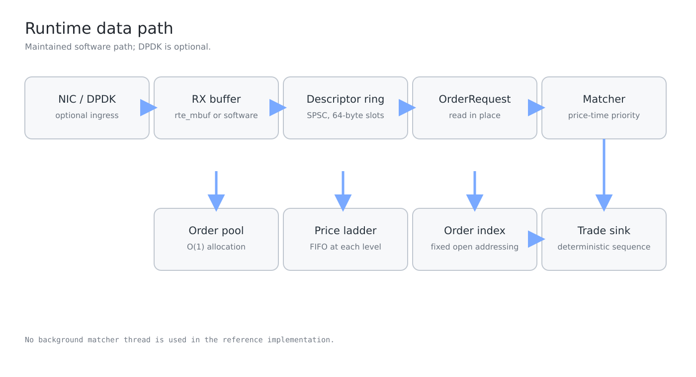

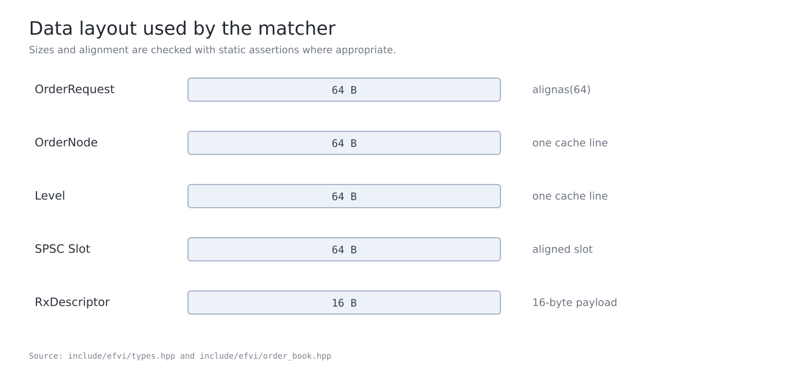

The main data path is:

    NIC or DPDK input
    -> RX buffer
    -> SPSC ring
    -> in-place OrderRequest
    -> fixed order pool
    -> price ladder + FIFO
    -> fixed order-ID index
    -> trade sink

See docs/architecture.md.

## Recorded run

The checked-in measurements are under docs/reference_run/current/.

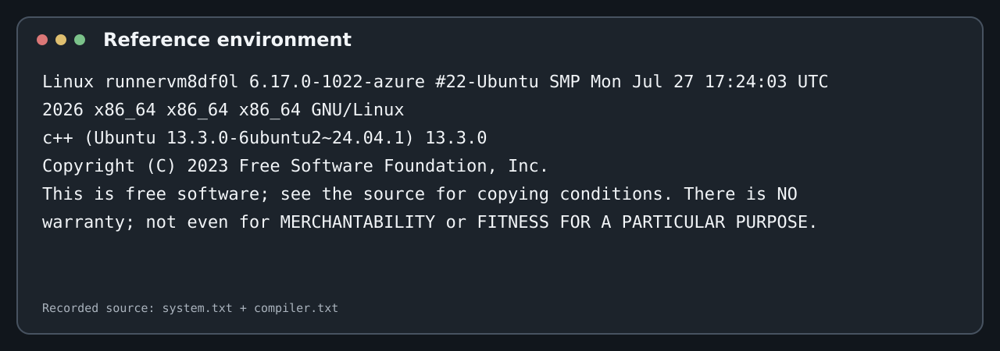

The raw files include:

- ctest_release.txt
- ctest_asan.txt
- benchmark_matrix.csv
- allocator_matrix.csv
- spsc_matrix.csv
- page_modes.csv
- analysis.txt
- experiment_console.txt
- system.txt
- compiler.txt

## Limits of the measurements

The code is complete and runnable on a normal Linux machine, but some measurements depend on the target host.

- HUGETLB availability is a kernel configuration issue.
- DPDK requires installed development files.
- Physical NIC testing requires a configured device.
- Latency and throughput depend on CPU, kernel, compiler, scheduler and process placement.
- A TLB benefit must be measured with target-CPU counters.

No hardware result is inferred when the hardware or kernel setup was not present in the recorded run.

## License

MIT.
