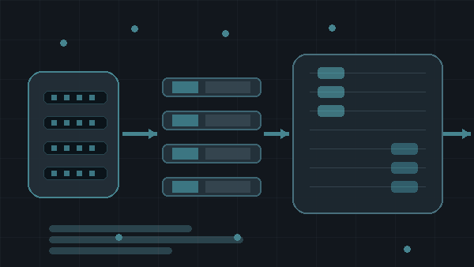
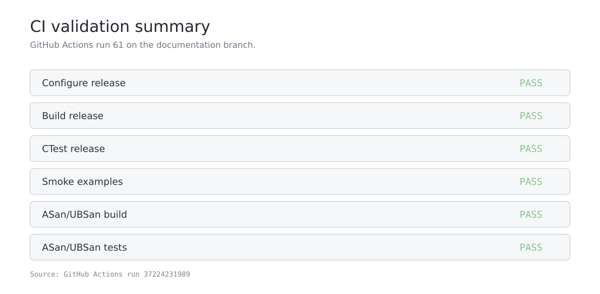

# EF_VI Zero-Copy Matcher

<p align="center">
  
</p>

A C++17/Linux limit-order-book matcher built around a fixed memory model, a cache-line-isolated SPSC ring, and an optional DPDK ingress path.

The implementation is kept small enough that the complete data path can be read from the repository. The normal software build uses only a C++17 compiler, CMake, POSIX threads, and Linux memory facilities.

## Current status

The software path is complete and runnable from a clean Linux checkout.

The repository includes two different dataplane levels:

1. A **software RX loopback** that uses the same in-place `OrderRequest` object before the matcher sees it. This can be run on any supported Linux machine and is the reference path for the zero-copy memory semantics.
2. An **optional DPDK adapter** using `rte_mbuf` and `rte_mempool`. This requires DPDK development packages. A real NIC path is host-specific and is not required for the matcher, tests, or reference benchmarks.

The code also supports explicit 2 MiB and 1 GiB Linux HUGETLB mappings. The benchmark reports which mapping was actually obtained. It does not label a run as a huge-page run when the host falls back to normal pages.

## What is in the repository

```text
include/efvi/
  types.hpp            request, trade, descriptor and book types
  spsc_ring.hpp        cache-line-isolated SPSC ring
  fixed_pool.hpp       fixed-capacity allocator and HUGETLB mapping
  order_book.hpp       deterministic price-time matcher
  transport.hpp        software RX buffer/descriptor path
  dpdk_adapter.hpp     optional DPDK interface

src/
  main.cpp             small matcher example
  hugepage_probe.cpp   Linux huge-page and data-layout probe
  dpdk_adapter.cpp     optional DPDK implementation

examples/
  order_flow_demo.cpp
  software_rx_loopback.cpp
  dpdk_nic_rx.cpp      optional DPDK capability probe

benchmarks/
  efvi_benchmark.cpp
  allocator_benchmark.cpp
  efvi_dpdk_benchmark.cpp

tests/
  efvi_tests.cpp

docs/
  architecture.md
  dpdk.md
  hugepages.md
  performance.md
  benchmark_300k_normal.txt
  allocator_200k.txt
  environment.txt
  reference_run/ci_61/   captured CI outputs used for the current figures
  images/               generated README figures

scripts/
  run.sh
  benchmark.sh
  hugepages_check.sh
  run_perf.sh
  bootstrap_ubuntu.sh
  render_readme_assets.py

Dockerfile
CMakeLists.txt
```

## Quick start

The quickest path on Ubuntu or another Debian-based Linux machine is:

```bash
git clone https://github.com/SpryzenHell/ef_vi_matcher.git
cd ef_vi_matcher
./scripts/bootstrap_ubuntu.sh
./scripts/run.sh
```

`run.sh` configures the project with the portable software path, builds it, runs the test suite, and then executes the matcher, software RX loopback, order-flow example, and huge-page probe.

A working session ends with output similar to this:

```text
EF_VI Zero-Copy Matcher
  ask rested: true
  bid filled: true
  best ask:   10000 ticks
  ask qty:    40
  trades:     1
  pool used:  1
  pool bytes: 4194304

software RX loopback
  original_order_address: 0x...
  matcher_order_address:  0x...
  same_buffer:             true
  rested:                  true
  live_orders:             1
  rx_pending:              0
```

The addresses are process-specific and are expected to change between runs.

## Clean build without the helper script

Required tools:

| Requirement | Purpose |
|---|---|
| Linux | `mmap`, HUGETLB and DPDK support |
| C++17 compiler | Build the matcher |
| CMake 3.20+ | Configure the project |
| POSIX threads | SPSC benchmark and tests |

On Ubuntu:

```bash
sudo apt update
sudo apt install build-essential cmake pkg-config
```

Then:

```bash
cmake -S . -B build \
  -DCMAKE_BUILD_TYPE=Release \
  -DEFVI_ENABLE_DPDK=OFF \
  -DEFVI_BUILD_TESTS=ON \
  -DEFVI_BUILD_BENCHMARKS=ON \
  -DEFVI_BUILD_EXAMPLES=ON

cmake --build build --parallel
ctest --test-dir build --output-on-failure
```


## Build targets

| Target | Purpose | Requires DPDK |
|---|---|---:|
| `efvi_matcher` | basic matcher smoke application | No |
| `efvi_software_rx_demo` | software zero-copy buffer/descriptor demonstration | No |
| `efvi_order_flow_demo` | FIFO and multi-order matching example | No |
| `efvi_hugepage_probe` | page-size and data-layout probe | No |
| `efvi_benchmark` | matcher and SPSC benchmark | No |
| `efvi_allocator_benchmark` | fixed-pool benchmark | No |
| `efvi_tests` | correctness and layout tests | No |
| `efvi_dpdk_benchmark` | DPDK mempool/mbuf benchmark | Yes |
| `efvi_dpdk_nic_rx_probe` | DPDK NIC capability probe | Yes |

## Run the examples

### Matcher example

```bash
./build/efvi_matcher
```

It inserts one resting sell order and then submits a buy order against it. The expected final state is one trade and 40 units remaining at the ask.

### Order-flow example

```bash
./build/efvi_order_flow_demo
```

This demonstrates FIFO at a single price level and a partial fill across two resting orders.

### Software RX loopback

```bash
./build/efvi_software_rx_demo
```

The example is deliberately small. It writes an `OrderRequest` into a fixed RX buffer, publishes a descriptor containing the buffer address, consumes the descriptor, and passes the same object to the matcher. The important line is:

```text
same_buffer:             true
```

That is the software demonstration of the ownership/data-path contract. There is no second heap allocation for the request.


## Tests

The test suite covers:

- price-time priority and partial fills;
- matching across multiple price levels;
- IOC and FOK handling;
- market IOC orders;
- cancel and cancel/replace;
- deterministic trade ordering;
- fixed-pool exhaustion and reuse;
- producer/consumer ordering in the SPSC ring;
- compile-time cache-line/size invariants.

Run it with:

```bash
ctest --test-dir build --output-on-failure
```

The project also has a sanitizer build:

```bash
cmake -S . -B build-asan \
  -DCMAKE_BUILD_TYPE=Debug \
  -DEFVI_ENABLE_DPDK=OFF \
  -DEFVI_ENABLE_SANITIZERS=ON

cmake --build build-asan --parallel
ctest --test-dir build-asan --output-on-failure
```

The repository's CI runs the same release and ASan/UBSan test stages.



## Performance benchmark

The reference benchmark measures matcher throughput, sampled p50/p99 latency, matching-loop allocations, actual page backing, and SPSC producer/consumer exchange rate.

Run:

```bash
./build/efvi_benchmark 50000 --normal
```

The benchmark also writes `efvi_benchmark.csv` in the current working directory.

The following values are from the captured GitHub Actions reference run used for the current README:

| Metric | Measured value |
|---|---:|
| Matcher operations | 50,000 |
| Matcher throughput | 2.096 M ops/s |
| Matcher p50 | 0.145 us |
| Matcher p99 | 0.318 us |
| Trades | 40,960 |
| Live orders at end | 0 |
| SPSC exchange | 58.679 M items/s |
| Matching-loop global `new` calls | 0 |
| Pool mapping | 64 MiB |
| Actual page size | 4096 bytes |
| HUGETLB backing | false |

These measurements are a reference for the checked-in code, not a hardware-independent performance guarantee. CPU frequency, scheduling, compiler version, kernel configuration, cache state, and process placement all affect latency numbers.


The raw command output is checked in under [`docs/reference_run/ci_61/`](docs/reference_run/ci_61/). The benchmark CSV is [`benchmark.csv`](docs/reference_run/ci_61/benchmark.csv) and the console output is [`benchmark_console.txt`](docs/reference_run/ci_61/benchmark_console.txt).

## Allocator benchmark

The allocator benchmark exercises the fixed pool directly:

```bash
./build/efvi_allocator_benchmark 10000
```

The captured reference run produced:

```text
objects=10000 alloc_ops_per_sec=134645679.893 free_ops_per_sec=699398517.275 stride=64 mapped_bytes=643072
```

Allocation and free operations are pointer manipulation on the pre-built intrusive free list. The mapping itself is created before the timed loop.


Raw output: [docs/reference_run/ci_61/allocator_benchmark.txt](docs/reference_run/ci_61/allocator_benchmark.txt).

## Huge pages

The fixed pool supports four modes:

| Mode | Behaviour |
|---|---|
| `normal` | regular Linux pages / aligned heap fallback |
| `huge2m` | request 2 MiB HUGETLB pages |
| `huge1g` | request 1 GiB HUGETLB pages |
| `auto` | use the largest suitable HUGETLB mode available, then fall back |

Inspect the host:

```bash
./build/efvi_hugepage_probe
```

On the reference CI host, the kernel reported zero reserved 1 GiB and 2 MiB HUGETLB pages, so automatic mode used normal 4 KiB pages.


Strict mode is useful when a benchmark must not silently fall back:

```bash
./build/efvi_benchmark 10000 --huge1g --strict
```

On a host without the required 1 GiB hugetlb page, the program exits with an explicit error rather than reporting a fake 1 GiB-page result.


Reference output: [docs/reference_run/ci_61/hugepage_strict.txt](docs/reference_run/ci_61/hugepage_strict.txt).

The project does not publish a TLB-miss reduction percentage until a matched normal-page/1 GiB-page experiment has been collected with processor-specific `perf` counters.

See [docs/hugepages.md](docs/hugepages.md) and [docs/performance.md](docs/performance.md) for the measurement procedure.

## DPDK build

DPDK is optional. The default build is intentionally usable without it.

On Ubuntu/Debian, install the distribution's DPDK development package. The exact package name may differ on other distributions.

Install it with:

```bash
sudo apt update
sudo apt install libdpdk-dev
```

Then configure the DPDK build:

```bash
cmake -S . -B build-dpdk \
  -DCMAKE_BUILD_TYPE=Release \
  -DEFVI_ENABLE_DPDK=ON

cmake --build build-dpdk --parallel
```

When CMake finds DPDK through `pkg-config`, it builds the optional `efvi_dpdk` library, DPDK benchmark, and NIC capability probe.

The DPDK code uses `rte_mempool`/`rte_mbuf` ownership and keeps the owner pointer beside the in-place request pointer. A real NIC receive loop should feed buffers from `rte_eth_rx_burst()` into the same ownership model.

The repository does **not** claim that a particular NIC was exercised by CI. NIC configuration, PCI binding, queues, NUMA placement and driver setup depend on the target machine.

See [docs/dpdk.md](docs/dpdk.md).

## Docker

For a clean reference build without installing a compiler on the host:

```bash
docker build -t efvi-zero-copy-matcher .
docker run --rm efvi-zero-copy-matcher
```

The Docker image runs the same software build and test path. DPDK and physical NIC access are intentionally outside the container's default path.

## Design notes

### Deterministic matching

The matcher uses a fixed price ladder. Each price level contains an intrusive FIFO of live orders. Matching starts at the best opposite-side price and consumes the oldest order at that level before moving to the next level.

A monotonic sequence number is assigned when an order is accepted. Trade events get their own monotonic sequence number. There is no background matching thread, timer, or worker pool in the reference implementation.

### Order lookup

Cancellations arrive by order ID, so the matcher keeps a fixed-capacity open-addressed lookup table alongside the price ladder. The table is created once and does not use `std::unordered_map` on the matching path.

### Fixed allocator

`FixedPool<T>` reserves the arena once and links free slots together inside the arena. After initialization, `allocate()` and `deallocate()` only manipulate pointers and a counter. This keeps the object allocation path bounded and avoids general-purpose allocator calls for new orders.

### Cache-line isolation

The SPSC ring aligns the ring object, producer cursor, consumer cursor and individual slots to 64-byte boundaries. Producer and consumer use acquire/release ordering and only one producer and one consumer are supported by design.

The alignment is an implementation choice for the target x86 cache-line assumption; it is not a claim that 64 bytes is universal for every architecture.

## Evidence and reproducibility

The repository keeps the raw benchmark outputs used for the README:

- [`docs/reference_run/ci_61/benchmark.csv`](docs/reference_run/ci_61/benchmark.csv)
- [`docs/reference_run/ci_61/benchmark_console.txt`](docs/reference_run/ci_61/benchmark_console.txt)
- [`docs/reference_run/ci_61/allocator_benchmark.txt`](docs/reference_run/ci_61/allocator_benchmark.txt)
- [`docs/reference_run/ci_61/hugepage_probe.txt`](docs/reference_run/ci_61/hugepage_probe.txt)
- [`docs/reference_run/ci_61/hugepage_strict.txt`](docs/reference_run/ci_61/hugepage_strict.txt)
- [`docs/reference_run/ci_61/software_rx_loopback.txt`](docs/reference_run/ci_61/software_rx_loopback.txt)

The figures under `docs/images/` are generated from the captured reference files in `docs/reference_run/ci_61/`. There are no hand-entered benchmark values in the figure-generation step.


## Local reference environment

```text
Ubuntu 24.04 GitHub Actions runner
Linux 6.17.0-1022-azure x86_64
GCC 13.3.0
DPDK: not installed
1 GiB hugepages: 0
2 MiB hugepages: 0
Actual pool backing in this run: 4096-byte normal pages
```

Exact environment output is kept in [docs/reference_run/ci_61/system.txt](docs/reference_run/ci_61/system.txt) and [docs/reference_run/ci_61/compiler.txt](docs/reference_run/ci_61/compiler.txt).

## Troubleshooting

### CMake cannot find a compiler

Install the base build toolchain:

```bash
sudo apt update
sudo apt install build-essential cmake pkg-config
```

### Huge-page mode exits with an error

That is expected in strict mode when the kernel has not reserved the requested HUGETLB page size. Check:

```bash
grep -E 'HugePages|Hugepagesize|Hugetlb' /proc/meminfo
./scripts/hugepages_check.sh
```

### DPDK targets do not appear

CMake only enables them when `libdpdk` is discoverable through `pkg-config`. Check:

```bash
pkg-config --modversion libdpdk
```

If it is missing, install the DPDK development package and configure again from a fresh `build-dpdk` directory.

### Running on Windows or macOS

The maintained project is Linux-only because the memory and dataplane work depends on Linux `mmap`/HUGETLB and optional DPDK support.

## Upstream components

The original project specification identifies these three repositories as inputs:

| Component | Repository | Used for |
|---|---|---|
| Liquibook | `objectcomputing/LiquiBook` / `enewhuis/liquibook` | order-book and matching behaviour |
| LightMatchingEngine | `gavincyi/LightMatchingEngine` | compact matching-engine examples and API ideas |
| atomic_queue | `max0x7ba/atomic_queue` | bounded queue, false-sharing and huge-page implementation ideas |

The maintained EFVI implementation is deliberately separated from the inherited source snapshot so that the active CMake build has one clear code path. See [`THIRD_PARTY_NOTICES.md`](THIRD_PARTY_NOTICES.md) before redistributing inherited source files.

## What is intentionally not claimed

This repository provides the implementation needed to run the software path, but some results depend on hardware that is not present on every machine:

- no Solarflare/Xilinx EF_VI NIC is assumed by the reference build;
- no DPDK NIC benchmark is reported unless DPDK and a configured NIC are actually available;
- no TLB-miss percentage is published without a real `perf` comparison;
- the reference benchmark numbers above are local measurements, not guarantees for a production trading system.

That separation is intentional. It keeps the source, benchmark output, and README consistent with what was actually executed.